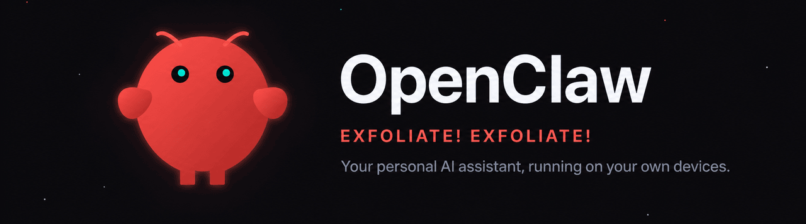

<div align="center">
  
</div>

# Build Your First AI Agent

**A hands-on workshop, powered by [OpenClaw](https://openclaw.ai)** · No installs · runs in your browser · about 90 minutes

📽️ **Workshop slides:** [tinyurl.com/aiGarage](https://tinyurl.com/aiGarage)

Welcome! Everything is already installed for you, **no setup, no code.** In a few
minutes you'll have your own AI agent running right in your browser. By the end,
you'll have taught it a brand-new skill *you* wrote. Just three things to start 👇

## 🚀 1. Open this in a Codespace

[](https://codespaces.new/MahmoudAlMoghrabi/openclaw?quickstart=1)

Click the button above (it's the same link on the screen and in the event
chat), then click the green **Create codespace** button on the page that
opens. Everything — the repo, the settings, the tools — is already chosen for
you. Give it about a minute to load. If you come back later, the same link
reopens the Codespace you already made.

## 🔑 2. Drop in your key

In the terminal at the bottom of the screen, run this and press **Enter**:

```
./scripts/use-key.sh
```

It asks for two things, both given to you at the session: the **workshop
passphrase** (on the screen) and **your slip number** (on the slip from the
door). Type them and press **Enter**. The passphrase stays hidden as you
type (nothing shows on screen), which is expected — it unlocks your own
personal key and sets everything up.

Wait a few seconds until it says **All set.**

## 💬 3. Open your agent

When the script says **All set**, your agent's page **opens in a new tab by
itself** (the same link is printed in the terminal — Ctrl+Click it if no tab
appeared). On that page, **leave the boxes empty and click Connect** — no
token needed. Then type "hello" in the chat.

> Backup route if the link won't open: click the **Ports** tab next to the
> terminal, find port **18789**, and click the globe icon.

If your agent replies, you are running a real AI agent. 🎉

> **If you see "The AI service is temporarily overloaded":** that is normal and
> not your fault, just send your message again. It usually works on the next try.

---

## 🛠️ During the workshop

**1. Try the demo skill.** Your agent already knows a skill called
`fortune-teller`. In the chat, say **"tell me my tech fortune for the week"**
and watch what it does. (A second demo skill, `standup-writer`, is installed
too if you want to try another.)

**2. Build your own skill.** The main exercise is `code-roaster`, a guided
build with a ready-made template. Open `skills/guided-skill/SKILL.md` and work
through the 5 TODOs to make the agent roast pasted code (funny, but every burn
is a real, fixable issue). The loop is:

- **Edit** `skills/guided-skill/SKILL.md` and **save** (Ctrl+S).
- In the terminal, run **`./scripts/reload-skill.sh`** so your
  agent picks up the change (it reloads every skill, no name needed).
- **Refresh** your agent's browser tab.
- In the chat, say **"roast this code"** and paste the sample from
  `skills/guided-skill/roast-me.js`. Then edit, reload, and retry to make it
  yours.

**3. Make it act.** So far the agent has only *talked*. Say **"read
repo/skills/guided-skill/roast-me.js yourself and roast it"** — it fetches
the file without you pasting anything (`repo/` is how your agent sees this
folder). Then say **"fix everything you roasted and save it as
repo/roast-me.fixed.js — show me the plan first."** Approve, and watch a new
file appear in the file explorer. Talking about code is a chatbot; changing it
is an agent.

**4. Use a real tool.** Ask **"what's the weather in St. John's right
now?"** The `weather-reporter` skill directs your agent to its built-in
`web_fetch` tool, which pulls live data from the internet — something the
model can't know from training
([skills/weather-reporter/SKILL.md](skills/weather-reporter/SKILL.md)).
Then ask **"roll 3 dice"** — that one comes from a tool server we plugged in
over MCP ([mcp/workshop-tools.js](mcp/workshop-tools.js), about a hundred
readable lines). Built-in or plugged-in, tools are how agents touch the
world.

**Want more ideas?** Open [skills/EXAMPLES.md](skills/EXAMPLES.md) for a menu of
fun and useful skills (an excuse generator, a pirate rewriter, a grammar fixer,
a quiz maker, and more), and [skills/stretch-ideas.md](skills/stretch-ideas.md)
if you finish early.

**Follow along on the big screen.** The workshop slides are the walkthrough:
they're on the projector, and you can open your own copy at
**[tinyurl.com/aiGarage](https://tinyurl.com/aiGarage)** and click through at
your own pace — or scan this with your phone:


Two things to watch:

- **Save, then reload:** editing the file isn't enough on its own; run
  `./scripts/reload-skill.sh` (then refresh the tab) so the agent
  sees changes.
- **Do not touch the `---` lines or the words before the colons:** only edit
  after `description:` and in the body.

## 🆘 If something looks stuck

Wave down a helper, or paste this into the terminal:

```
./scripts/start-gateway.sh
```

Then refresh the browser tab with your agent in it. To confirm everything is
green, run:

```
./scripts/healthcheck.sh
```

**Seeing "reply session initialization conflicted"?** It's a timing hiccup,
not you: **just send your message again.** If it happens on every single
message, keep only ONE agent tab open and run the reset button, then follow
what it prints:

```
./scripts/reset-agent.sh
```

---

<div align="center">
  
  <br />
  <sub>Built with <a href="https://openclaw.ai">OpenClaw</a> 🦞</sub>
</div>
